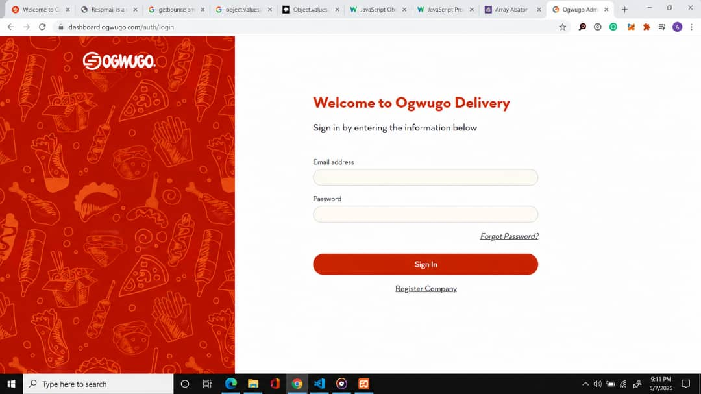

## ABOUT ME

I’m Amalachukwu Abafor, a Frontend Developer and UI-focused creative who builds responsive, interactive and user-friendly web experiences.

My work sits at the intersection of clean frontend development and thoughtful visual design. I enjoy turning designs and product ideas into functional interfaces that work well across devices, with attention to responsiveness, accessibility, usability and visual consistency.

I have worked on web applications, e-commerce interfaces, dashboards and business websites using technologies including React JS, Redux JS, JavaScript, HTML, CSS, WordPress and Node.js.

I studied Electronic Engineering at the University of Nigeria, Nsukka, where I earned a bachelor’s degree. My engineering background strengthened the problem-solving approach I bring to software development.

I’m currently open to a full-time remote Frontend Developer opportunity where I can contribute to real products, work with a strong engineering team and continue building better web experiences.

## ACHIEVEMENT

* Built and contributed to frontend projects for companies and products including Ogwugo Limited, Xend Africa, Ugarsoft Limited and Wicrypt Limited.

* Developed an administrative dashboard for Ogwugo to help the business manage orders, employees, riders and delivery activities through a centralized interface.

* Built ShapeIn, an interactive design application using React JS, Redux JS and Konva, allowing users to create designs with shapes.

* Developed and worked on multiple customer-facing web platforms including Geena Shop, Wicrypt, Xend.ng, Urban Radio Enugu and Ogwugo.com.

* Combined frontend development with UX/UI design, graphics and accessibility principles to create interfaces that are both functional and visually engaging.

## WHAT I DO

I’m a Frontend Developer focused on building responsive web interfaces and interactive applications that solve real product and business needs.

I work with modern frontend technologies to turn ideas, designs and requirements into usable web experiences. My projects range from administrative dashboards and e-commerce platforms to interactive design applications and business websites.

I pay close attention to responsive layouts, component structure, user interactions, accessibility and the details that make an interface easy to use.

I’m looking for a remote Frontend Developer role where I can contribute to product development, collaborate with designers and backend developers, and build frontend experiences that users can rely on.

## TECHNICAL SKILLS

* **Frontend Development:** React JS, Redux JS, JavaScript, HTML5, CSS3, Responsive Web Development

* **UI Engineering:** Responsive Layouts, Modern CSS, Web Animations, Accessibility, Reusable Interface Components

* **Application Development:** React JS, Redux JS, Konva, Node.js, REST API Integration and Postman

* **Web Development:** HTML, CSS, JavaScript, WordPress and Business Website Development

* **Design:** UX/UI Design, Interface Design, Graphics, Illustration and Visual Communication

* **Development Tools:** GitHub, Postman and Modern Browser Development Tools

## SOFT SKILLS

* **Problem Solving:** I approach frontend challenges by breaking them into smaller, practical problems and building solutions that are easy to understand and maintain.

* **Attention to Detail:** My design background helps me pay close attention to spacing, typography, responsiveness, interaction and visual consistency.

* **Adaptability:** I’m comfortable learning new technologies and adapting to different products, development environments and project requirements.

* **Collaboration:** I can work across design, frontend and product requirements while communicating clearly with other people involved in a project.

* **Creativity:** I combine technical development with a strong visual sense to create interfaces that are functional without losing their design quality.

* **Continuous Learning:** I actively continue developing my frontend skills and keeping up with technologies and practices that improve the quality of my work.

# MY PROJECTS

## CASE STUDY 1 - OGWUGO ADMIN DASHBOARD: ORDER AND DELIVERY MANAGEMENT

**Tech Stack:** React JS, Redux JS, Postman, UX/UI Design

### BUSINESS PROBLEM

Ogwugo was handling a growing number of orders through its online store and needed a centralized interface that could help employees and management manage orders and delivery activities more effectively.

### SOLUTION

I worked on the Ogwugo Admin Dashboard, an administrative interface designed to give the business better control over its order and delivery operations.

The dashboard allows employees to manage incoming orders, create orders, assign orders to available riders and monitor delivery activities.

### KEY FEATURES

* Order management and monitoring
* Employee-created orders
* Rider assignment
* Delivery activity management
* Centralized administrative interface
* Responsive user interface

### DEVELOPMENT APPROACH

I used React JS and Redux JS to build the frontend application and manage application state. Postman was used during API-related development and testing, while UX/UI principles guided the interface design.

### BUSINESS IMPACT

The dashboard provided Ogwugo with a centralized frontend interface for managing order and delivery operations, giving employees and management a clearer way to monitor activities as order volume increased.

